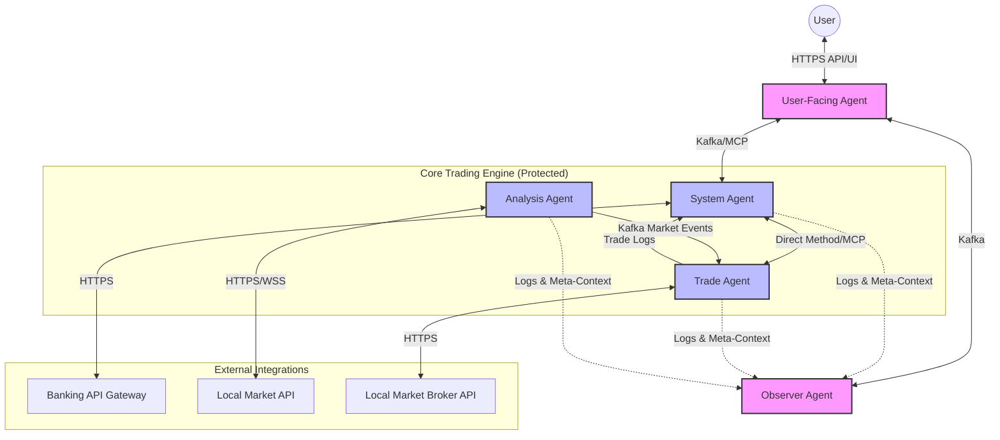

# Antigravity Trading System - Architecture & Design (Phase 2)

## 1. High-Level System Architecture

The Antigravity trading system is modeled as a reactive, event-driven microservices architecture built on **Java 21 and Spring Boot 3.x**. We utilize **Spring AI** as the core abstraction layer to manage the LLM runtime contexts.

This architecture specifically focuses on the **LocalMarket v1** operating model as dictated by the FRS, utilizing an AWS-native cloud footprint.

### AWS Infrastructure Footprint
*   **Compute**: Amazon EKS (Elastic Kubernetes Service) to orchestrate the Spring Boot agent microservices, scaled via KEDA (Kubernetes Event-driven Autoscaling).
*   **Event Bus**: Amazon MSK (Managed Streaming for Apache Kafka) for high-throughput, real-time message brokering across agents.
*   **Storage**: 
    *   Amazon Aurora PostgreSQL (Primary state, Capital Tracking, Trade History)
    *   Amazon ElastiCache / Redis (Fast market data buffering, token rate limits)
*   **API Management**: AWS API Gateway handling ingress to the Spring App, terminating TLS/HTTPS.
*   **Secret Management**: AWS Secrets Manager (API keys, banking credentials, LLM keys).
*   **Observability**: Amazon CloudWatch for metrics + OpenTelemetry sidecars shipping traces to AWS X-Ray.

---

## 2. Spring AI Multi-Agent Network Topology

The agents are standalone Spring Boot services or isolated actors within a unified deployment, communicating either via Kafka events or direct MCP (Model Context Protocol) tool calls.

### Agent Responsibilities & Workflows

#### 1. User-Facing Agent (Trust & UI Interface)
*   **Role**: The firewall between the user and raw algorithmic outputs. Filters technical data into human-readable insights.
*   **Protocol**: HTTPS (REST/GraphQL) ingress from the frontend.
*   **Communication**: Translates user intents (e.g., "Withdraw $500") into strict JSON schemas sent over Kafka/MCP to the System Agent.

#### 2. System Agent (Integrity & Banking)
*   **Role**: The absolute enforcer of the `Current_Value(t) >= Initial_Capital + Σ Deposits(t)` constraint.
*   **Workflow**: 
    *   Intercepts withdrawal requests.
    *   Queries Aurora DB to verify current isolated initial capital versus accumulated profits.
    *   Approves or denies the Bank API call.
    *   Manages overarching wallet lifecycle for the Trade Agent.

#### 3. Analysis Agent (Market Data)
*   **Role**: Quantitative modelling and data digestion for LocalMarket data streams.
*   **Workflow**: 
    *   Pulls data from Local Market APIs.
    *   Calculates moving averages, RSI, and detects volume anomalies (Whale activity).
    *   Publishes cleaned "Market Health Events" to Kafka.

#### 4. Trade Agent (Strategy & Execution)
*   **Role**: Risk-aware strategy execution.
*   **Workflow**: 
    *   Subscribes to Analysis Agent topics.
    *   Selects strategies (Discrete compounding logic as per `math_derivations.md`).
    *   Validates trades against the `10% CVaR` threshold limit.
    *   Executes Buy/Sell API requests.

#### 5. Observer Agent (Monitoring & Tuning)
*   **Role**: Enforces `GEMINI.md` hard constraints dynamically.
*   **Workflow**: 
    *   Ingests execution logs and agent prompt traces via asynchronous event queues.
    *   Scores hallucination probability. If confidence < 0.85, it utilizes MCP tools to restart or dial back the context window of the failing agent node.

---

## 3. Communication Protocols

1.  **Event-Driven (Kafka/MSK)**: Used for high-volume, asynchronous data (e.g., Analysis Agent streaming market price ticks to the Trade Agent).
2.  **MCP (Model Context Protocol)**: Used for secure, synchronous tool-use. When the Trade Agent needs to verify its wallet balance before a trade, it uses MCP to strictly ask the System Agent, rather than hitting the database directly. This prevents authorization bypasses.
