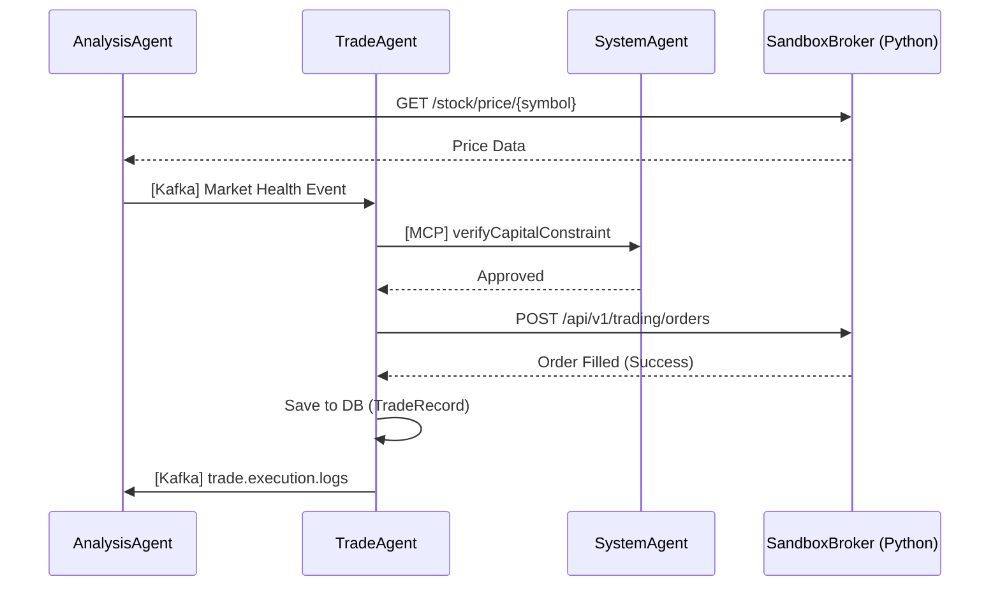

# System Design Document — Antigravity Trading System v1.0.1
> **Document Version:** v1.0.1
> **Date:** 2026-02-24
> **Author:** Architecture Agent
> **Status:** Draft — For Developer Implementation

## 1. Objective
Map the internal `trading-engine` (Java/Spring Boot) components to the newly integrated high-fidelity sandbox `open-paper-trading-mcp` (Python/FastAPI). Resolve the gap in trade execution and market data polling schemas.

## 2. API Schema Mapping (Sandbox Integration)

The `open-paper-trading-mcp` provides a REST API under the prefix `/api/v1/trading`.

| Feature | Java Interface / Client | Sandbox Endpoint (REST) | MCP Tool Equivalent |
| :--- | :--- | :--- | :--- |
| **Market Data** | `LocalMarketApiClient.fetchLatestMarketData` | `GET /stock/price/{symbol}` | `stock_price(symbol)` |
| **Trade Execution** | `SandboxBrokerClient.placeOrder` (New) | `POST /orders` | `create_order(...)` |
| **Account Sync** | `AnalysisAgent` (Periodic Sync) | `GET /account/balance` | `get_account_balance()` |
| **Portfolio Sync** | `UserFacingAgent` (Fetch) | `GET /portfolio` | `get_portfolio()` |

### 2.1 Market Data Schema Mapping
The sandbox `GET /stock/price/{symbol}` returns:
```json
{
  "success": true,
  "symbol": "AAPL",
  "price_data": {
    "price": 150.00,
    "high": 155.00,
    "low": 145.00,
    "volume": 1000000
  },
  "message": "..."
}
```
**Java Impact:** `LocalMarketApiClient` must be updated to handle the `price_data` nesting.

### 2.2 Order Execution Schema Mapping
New `SandboxBrokerClient` will send:
```json
{
  "symbol": "ASSET_ID",
  "order_type": "buy|sell",
  "quantity": 10,
  "condition": "market|limit"
}
```
**Java Impact:** Create `com.antigravity.agents.trade.SandboxBrokerClient` using `WebClient`.

## 3. Component Updates

### 3.1 `LocalMarketApiClient` (Refactor)
- Update URI template: `localMarketBaseUrl + "/stock/price/{assetId}"`.
- Ensure it handles the new JSON structure.

### 3.2 `TradeAgent` (Refactor)
- Inject `SandboxBrokerClient`.
- After positive `verifyCapitalConstraint` check, call `sandboxBrokerClient.placeOrder(...)`.

### 3.3 New Component: `SandboxBrokerClient`
- Base URL: `${antigravity.api.sandbox.broker.url}`.
- Method: `placeOrder(OrderRequest req)`.
- Method: `getAccountBalance()`.

## 4. Sequence Diagram (V1.0.1 Trade Flow)



## 5. Deployment Context
- **Sandbox Broker:** `http://sandbox-broker:2080/api/v1/trading`
- **MCP Port:** `2081` (reserved for direct LLM tool usage by Observer Agent)

## 6. Mathematical Constraints Enforcement
- The `TradeAgent` **MUST** call `verifyCapitalConstraint` via the `SystemAgent` (Java) before any call to the Python Sandbox Broker.
- The Python Sandbox Broker is treated as an "Unreliable Execution Environment"—it only tracks CDS state. The `SystemAgent` is the **Single Source of Truth (SSoT)** for the Capital Preservation Constraint.
