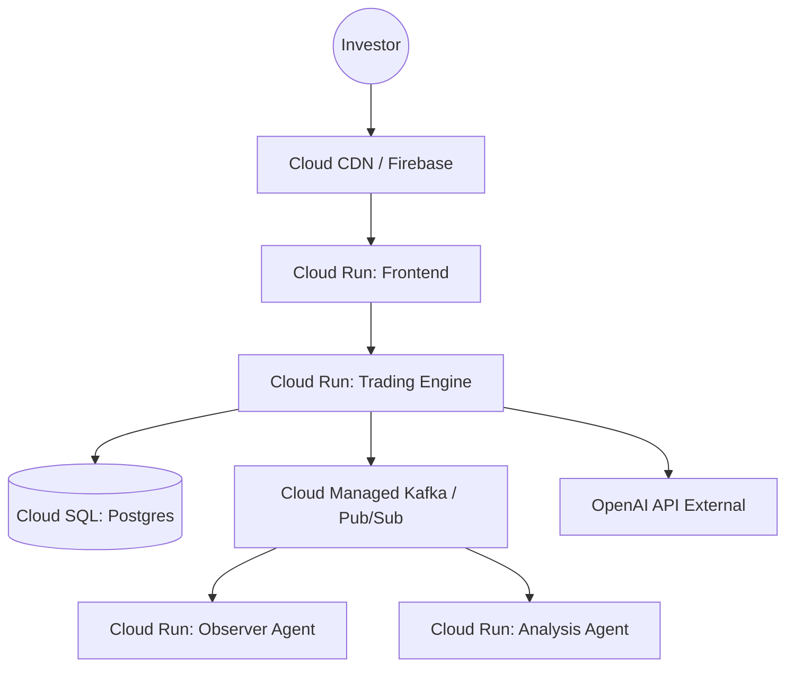

# GCP Deployment Document — Antigravity Trading System v1.0.1
> **Document Version:** v1.0.1-GCP
> **Date:** 2026-02-24
> **Author:** DevOps Engineer Agent

---

## 1. Overview
This document outlines the migration of the Antigravity infrastructure from local Docker/AWS to **Google Cloud Platform (GCP)**, utilizing managed services to minimize operational overhead and maximize security.

## 2. Service Mapping

| Component | AWS Equivalent | GCP Target Service | Purpose |
|-----------|----------------|--------------------|---------|
| **Trading Engine** | App Runner / ECS | **Cloud Run** | Serverless backend execution. |
| **NextJS UI** | Amplify / S3 | **Cloud Run / Firebase Hosting** | Frontend hosting with global CDN. |
| **Database** | RDS (Postgres) | **Cloud SQL (PostgreSQL)** | Persistent storage for portfolios and trades. |
| **Event Bus** | MSK (Kafka) | **Pub/Sub (via Kafka Connector)** or **Cloud Managed Kafka** | Real-time agent communication. |
| **Secrets** | Secrets Manager | **Secret Manager** | API keys and DB credentials. |
| **Monitoring** | CloudWatch | **Cloud Logging & Monitoring** | Audit traces and agent performance. |

---

## 3. Deployment Architecture



---

## 4. GCP Provisioning Checklist

### 4.1 Networking
- [ ] Create a **VPC Network** (`antigravity-vpc`).
- [ ] Configure **Private Service Access** for Cloud SQL.
- [ ] Setup Serverless VPC Access Connector for Cloud Run.

### 4.2 Security & IAM
- [ ] Create Service Account: `antigravity-agent-sa`.
- [ ] Grant `roles/cloudsql.client` and `roles/secretmanager.secretAccessor`.
- [ ] Enable **IAM Conditions** to restrict access to Production environment.

### 4.3 Database (Cloud SQL)
- [ ] Instance: `antigravity-db-v1`.
- [ ] Version: PostgreSQL 15.
- [ ] Tier: `db-f1-micro` (Within Free Credit range).

---

## 5. Deployment Commands (gcloud CLI)

```bash
# 1. Build and push to Artifact Registry
gcloud builds submit --tag gcr.io/[PROJECT_ID]/antigravity-backend ./trading-engine
gcloud builds submit --tag gcr.io/[PROJECT_ID]/antigravity-ui ./ui

# 2. Deploy Backend
gcloud run deploy antigravity-backend \
  --image gcr.io/[PROJECT_ID]/antigravity-backend \
  --set-env-vars="SPRING_PROFILES_ACTIVE=prod" \
  --vpc-connector=antigravity-connector \
  --allow-unauthenticated

# 3. Deploy Frontend
gcloud run deploy antigravity-ui \
  --image gcr.io/[PROJECT_ID]/antigravity-ui \
  --allow-unauthenticated
```
